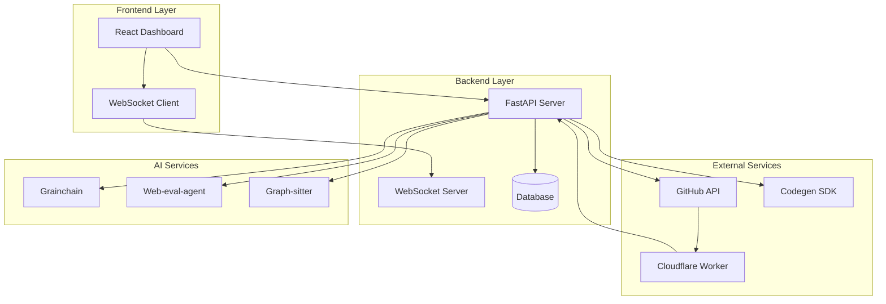
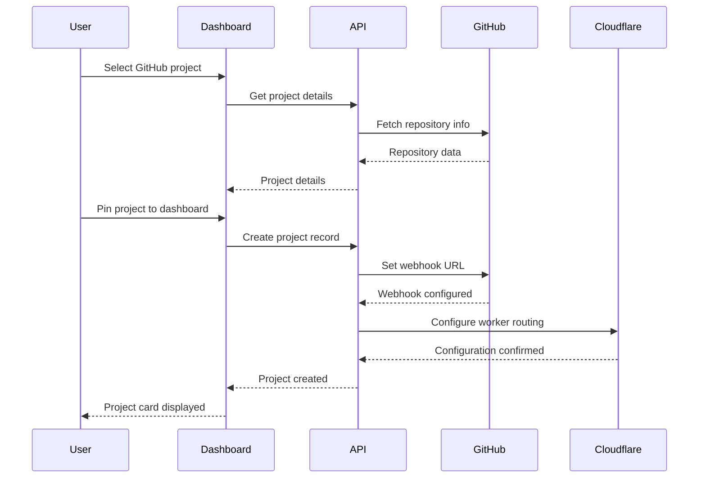
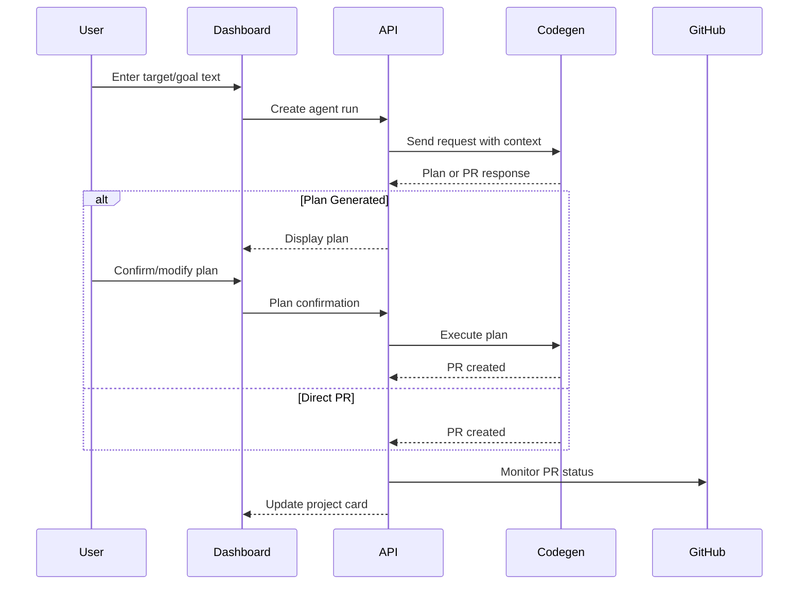
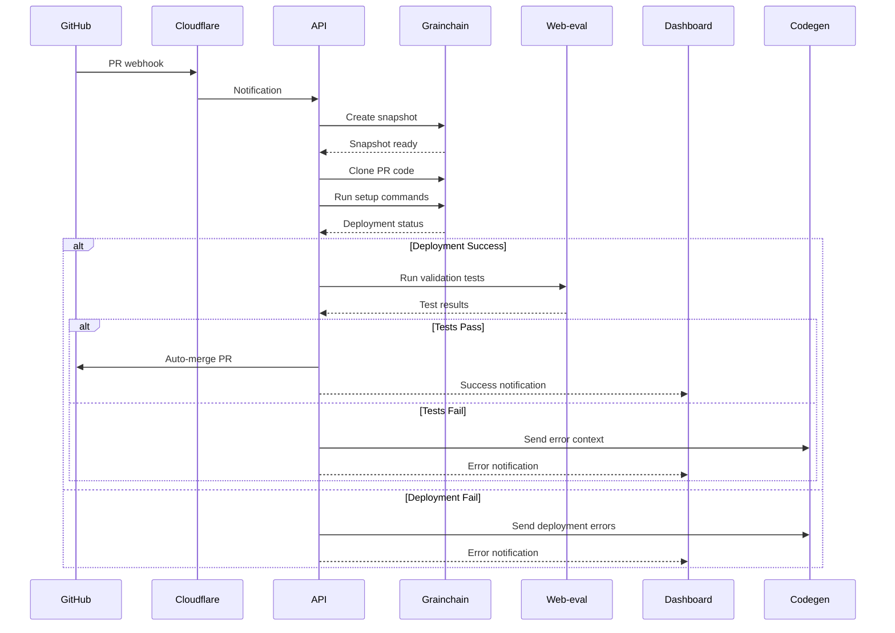

# 🏗️ CodegenApp System Architecture

## Overview
CodegenApp is a comprehensive GitHub project dashboard with full CI/CD automation, built using a microservices architecture that orchestrates multiple AI agents and external services to automate the complete development workflow.

## 🎯 System Goals
- **Automated Development Workflow**: From requirements to deployed code
- **Real-time Project Management**: Live dashboard with GitHub integration
- **Intelligent Validation**: AI-powered PR testing and validation
- **Seamless Integration**: GitHub, Cloudflare, and AI services working together

## 🏛️ High-Level Architecture



## 🔧 Component Details

### Frontend Layer

#### React Dashboard
- **Purpose**: Main user interface for project management
- **Components**:
  - Project selector dropdown
  - Project cards with status indicators
  - Agent run dialogs
  - Settings panels
  - Real-time notifications

#### WebSocket Client
- **Purpose**: Real-time communication with backend
- **Features**:
  - Live project status updates
  - PR notification delivery
  - Validation progress tracking

### Backend Layer

#### FastAPI Server
- **Purpose**: Core API server and business logic
- **Modules**:
  - Project management
  - GitHub integration
  - Agent orchestration
  - Validation pipeline
  - Webhook handling

#### Database
- **Purpose**: Persistent data storage
- **Schema**:
  - Projects and configurations
  - Agent run history
  - Validation states
  - User settings

### External Services

#### GitHub API
- **Purpose**: Repository operations and webhook management
- **Operations**:
  - List user repositories
  - Set/manage webhooks
  - Create/update PRs
  - Merge operations

#### Cloudflare Worker
- **Purpose**: Webhook handling and notification routing
- **Functions**:
  - Receive GitHub webhooks
  - Validate payloads
  - Forward notifications to main app
  - Handle authentication

#### Codegen SDK
- **Purpose**: AI agent coordination and code generation
- **Features**:
  - Agent run management
  - Plan generation
  - Code generation
  - Continuous execution

### AI Services

#### Grainchain
- **Purpose**: Sandboxing and snapshot management
- **Capabilities**:
  - Create isolated environments
  - Snapshot creation/restoration
  - Secure code execution
  - Resource management

#### Web-eval-agent
- **Purpose**: Automated UI testing and validation
- **Features**:
  - Browser automation
  - UI component testing
  - User flow validation
  - Performance testing

#### Graph-sitter
- **Purpose**: Static code analysis and quality metrics
- **Functions**:
  - Code structure analysis
  - Quality metrics
  - Dependency analysis
  - Security scanning

## 📊 Data Models

### Project Model
```python
class Project:
    id: str
    name: str
    github_url: str
    webhook_url: str
    repository_rules: str
    setup_commands: List[str]
    secrets: Dict[str, str]
    auto_merge_enabled: bool
    auto_confirm_plans: bool
    planning_statement: str
    created_at: datetime
    updated_at: datetime
```

### Agent Run Model
```python
class AgentRun:
    id: str
    project_id: str
    target_text: str
    status: str  # pending, running, completed, failed
    plan_generated: bool
    pr_created: bool
    validation_status: str
    created_at: datetime
    completed_at: datetime
```

### Validation State Model
```python
class ValidationState:
    id: str
    agent_run_id: str
    pr_number: int
    snapshot_id: str
    deployment_status: str
    test_results: Dict
    auto_merge_eligible: bool
    created_at: datetime
```

## 🔄 Workflow Orchestration

### 1. Project Setup Flow


### 2. Agent Run Flow


### 3. Validation Flow


## 🔐 Security Architecture

### Authentication & Authorization
- **JWT Tokens**: Secure API authentication
- **GitHub OAuth**: Repository access authorization
- **Webhook Signatures**: Secure webhook validation
- **Environment Variables**: Secure secrets management

### Data Protection
- **Encrypted Storage**: Sensitive data encryption at rest
- **Secure Transmission**: HTTPS/WSS for all communications
- **Access Control**: Role-based permissions
- **Audit Logging**: Complete action tracking

### Webhook Security
- **Signature Validation**: GitHub webhook signature verification
- **Rate Limiting**: Protection against abuse
- **IP Whitelisting**: Restrict webhook sources
- **Payload Validation**: Strict payload schema validation

## 📈 Scalability Considerations

### Horizontal Scaling
- **Stateless API**: Enable multiple server instances
- **Load Balancing**: Distribute traffic across instances
- **Database Sharding**: Scale data storage
- **Queue Processing**: Async task handling

### Performance Optimization
- **Caching**: Redis for frequently accessed data
- **Connection Pooling**: Efficient database connections
- **CDN**: Static asset delivery
- **Compression**: Reduce payload sizes

### Resource Management
- **Container Orchestration**: Docker/Kubernetes deployment
- **Auto-scaling**: Dynamic resource allocation
- **Monitoring**: Real-time performance tracking
- **Alerting**: Proactive issue detection

## 🔍 Monitoring & Observability

### Application Metrics
- **Response Times**: API endpoint performance
- **Error Rates**: System reliability tracking
- **Throughput**: Request volume monitoring
- **Resource Usage**: CPU, memory, disk utilization

### Business Metrics
- **Agent Run Success Rate**: Workflow effectiveness
- **Validation Pipeline Performance**: Testing efficiency
- **Auto-merge Rate**: Automation success
- **User Engagement**: Dashboard usage patterns

### Logging Strategy
- **Structured Logging**: JSON format for parsing
- **Log Levels**: Appropriate severity classification
- **Centralized Collection**: Aggregated log storage
- **Search & Analysis**: Log querying capabilities

## 🚀 Deployment Architecture

### Development Environment
```yaml
services:
  - codegenapp-dev
  - postgres-dev
  - redis-dev
  - cloudflare-worker-dev
```

### Production Environment
```yaml
services:
  - codegenapp-prod (multiple instances)
  - postgres-prod (primary/replica)
  - redis-cluster
  - cloudflare-worker-prod
  - load-balancer
  - monitoring-stack
```

### CI/CD Pipeline
1. **Code Commit**: Developer pushes changes
2. **Automated Testing**: Unit and integration tests
3. **Build Process**: Container image creation
4. **Staging Deployment**: Pre-production testing
5. **Production Deployment**: Blue-green deployment
6. **Health Checks**: Post-deployment validation

## 🔧 Configuration Management

### Environment Variables
```bash
# Core Application
HOST=0.0.0.0
PORT=3001
DEBUG=false

# Database
DATABASE_URL=postgresql://...
REDIS_URL=redis://...

# External Services
CODEGEN_API_KEY=sk-...
GITHUB_TOKEN=github_pat_...
GEMINI_API_KEY=AIzaSy...
CLOUDFLARE_API_KEY=...

# Security
JWT_SECRET_KEY=...
WEBHOOK_SECRET=...
```

### Feature Flags
- **Auto-merge**: Enable/disable automatic PR merging
- **Validation Pipeline**: Toggle validation requirements
- **Real-time Updates**: Control WebSocket features
- **Debug Mode**: Enhanced logging and debugging

## 📋 API Specification

### Core Endpoints
```
GET    /api/v1/projects              # List projects
POST   /api/v1/projects              # Create project
GET    /api/v1/projects/{id}         # Get project details
PUT    /api/v1/projects/{id}         # Update project
DELETE /api/v1/projects/{id}         # Delete project

POST   /api/v1/projects/{id}/agent-run    # Start agent run
GET    /api/v1/projects/{id}/runs         # List agent runs
GET    /api/v1/runs/{id}                  # Get run details

POST   /api/v1/webhooks/github       # GitHub webhook handler
GET    /api/v1/validation/{id}       # Validation status
POST   /api/v1/validation/{id}/retry # Retry validation

GET    /health                       # Health check
GET    /metrics                      # Prometheus metrics
```

### WebSocket Events
```
project.status.updated
agent.run.started
agent.run.completed
pr.created
pr.updated
validation.started
validation.completed
notification.new
```

## 🎯 Future Enhancements

### Planned Features
- **Multi-repository Support**: Handle monorepos and related projects
- **Custom Validation Rules**: User-defined validation criteria
- **Integration Marketplace**: Third-party service integrations
- **Advanced Analytics**: Detailed workflow insights

### Scalability Improvements
- **Microservices Split**: Separate validation and orchestration services
- **Event Sourcing**: Complete audit trail and replay capabilities
- **GraphQL API**: More efficient data fetching
- **Serverless Functions**: Cost-effective scaling for specific operations

---

**Document Version**: 1.0.0
**Last Updated**: 2025-08-01
**Maintained By**: CodegenApp Development Team

